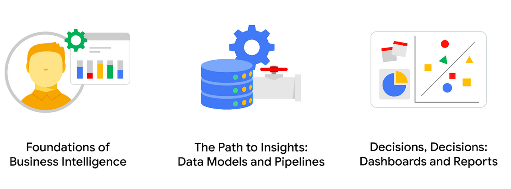

### Google Business Intelligence Certificate Program Overview

- **Introduction**
  - Welcome to the Google Business Intelligence Certificate program!
  - Explore the vital field of business intelligence (BI) and develop skills for a future career.

- **Importance of BI**
  - BI professionals bridge the gap in data analytics skills within companies.
  - Demand for BI skills is growing rapidly, outpacing other skills in the US job market.
  - BI professionals play a crucial role in retrieving, structuring, interpreting, and reporting data for informed decision-making.

- **Program Structure**
  - Three courses cover essential BI concepts and practical skills.
  - Hands-on assignments and projects simulate real-world BI responsibilities.
  - Courses focus on understanding BI roles, creating decision-making tools, and producing dynamic reports and dashboards.
  - Each course culminates in a portfolio end-of-course project to showcase learned skills to potential employers.

- **Course Details**
  - **Foundations of Business Intelligence (current course)**
    - Provides fundamental BI knowledge and skills.
  - **The Path to Insights: Data Models and Pipelines**
    - Explores data modeling and pipeline development.
  - **Decisions, Decisions: Dashboards and Reports**
    - Covers dashboard and report creation for effective data visualization.
    
    

- **Integration with Google Data Analytics Certificate**
  - The BI program builds on foundational concepts from the Google Data Analytics Certificate.
  - Optional review materials from the Data Analytics Certificate are provided throughout the BI program.

- **Benefits for Graduates**
  - Access to exclusive job search resources from Google upon completing the program:
    - Resume building, mock interviews, and job search tips through Big Interview.
    - Interview Warmup tool tailored for BI graduates, featuring practice questions and automatic insights.
    - Access to job postings and one-on-one career coaching with Career Circle.
    - Google Business Intelligence Certificate badge for LinkedIn to enhance visibility to potential employers.

- **Conclusion**
  - Congratulations on taking the first step toward a career in business intelligence!
  - Enjoy the learning journey and the opportunities it brings.

