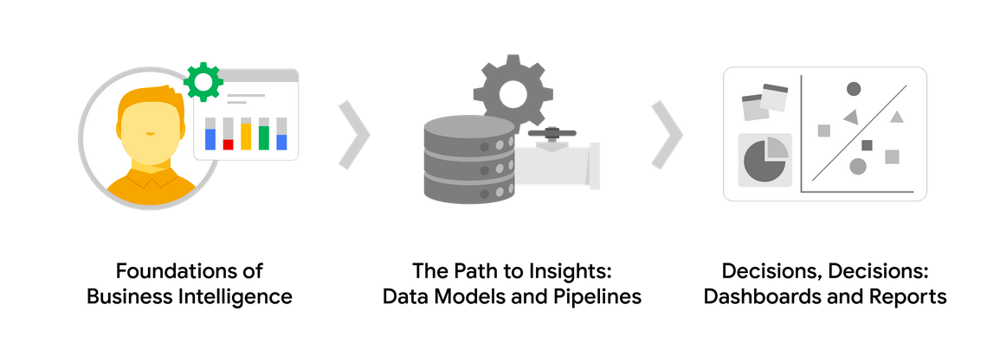
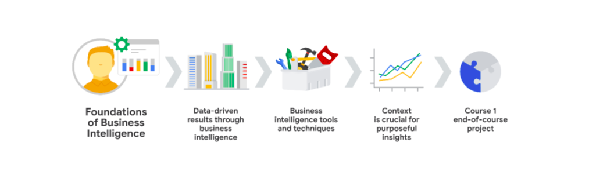

### Foundations of Business Intelligence: Course Overview

Hello, and welcome to **Foundations of Business Intelligence**, the first course in the Google Business Intelligence Certificate. You’re starting an exciting journey!

By the end of this course, you will:
- Discover the role of business intelligence (BI) professionals within an organization.
- Explore how data is used in business processes and decision-making.
- Investigate BI tools you can use on the job.

#### Course Descriptions

The Google Business Intelligence Certificate has three courses. **Foundations of Business Intelligence** is the first course.

- **Foundations of Business Intelligence** — (current course)
  - Discover the role of BI professionals within an organization and the career paths they typically follow.
  - Explore core BI practices and tools and learn how BI professionals use them to make a positive impact on organizations.

- **The Path to Insights: Data Models and Pipelines**
  - Explore data modeling and ETL processes for extracting data from source systems, transforming it into formats that better enable analysis, and driving business processes and goals.

- **Decisions, Decisions: Dashboards and Reports**
  - Apply your knowledge of BI and data modeling to create dynamic dashboards that track key performance indicators to meet stakeholder needs.

#### Course 1 Content

Each course of this certificate program is broken into weeks. You can complete courses at your own pace, but the weekly breakdowns are designed to help you finish the entire Google Business Intelligence Certificate in two to four months.

**What’s to come?** Here’s a quick overview of the skills you’ll learn in each week of this course:

**Week 1: Data-driven results through business intelligence**

- Explore the Coursera platform, procedures, and content types.
- Learn about the BI industry, roles of BI analysts and engineers.
- Introduction to BI tools and techniques for making business decisions and improving processes.

**Week 2: Business intelligence tools and techniques**
- Learn how to effectively engage with stakeholders.
- Utilize BI tools to make the most of available data.
- Develop strategies for networking, mentorship, and portfolio creation.

**Week 3: Context is crucial for purposeful insights**
- Reexamine data limitations and strategies to overcome them.
- Understand how BI professionals anticipate and address constant change.
- Learn more about metrics and their relation to context.

**Week 4: Course 1 end-of-course project**
- Complete a BI portfolio project based on a BI case study.
- Identify specific industries and projects of interest.
- Gain strategies for effective communication with potential employers.

#### What to Expect

Each course offers various learning opportunities, including:
- Videos led by Google instructors.
- Readings, discussion prompts, self-review activities, and labs.
- Interactive plug-ins, quizzes, and graded assessments.

#### Tips for Success

- Go through the items in each lesson in sequential order.
- Participate in all learning opportunities.
- Don’t hesitate to review or repeat activities if something is confusing.
- Utilize additional resources referenced in the course.
- Follow the Coursera Code of Conduct for a supportive learning environment.